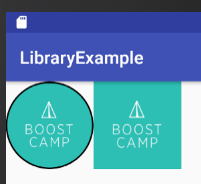

# 외부 주요 라이브러리
* [피카소(Picasso)](#피카소)
* [그라이드(Glide)](#그라이드)
* [토스티(Toasty)](#토스티)
* [서클이미지뷰(CircleImageView)](#서클이미지뷰)
* [리트로핏2(Retrofit2)](#리트로핏)
* [지슨(Gson)](#지슨)
* [버터나이프(Butter Knife)](#버터나이프)
* [켄번스뷰(KenBurnsView)](#켄번스뷰)
* [대거(Dagger)](#대거)
* [코틀린(Kotlin)](#코틀린)

<a name="피카소"></a>
## 피카소(Picasso)

피카소는 이미지를 불러와서 ImageView에 손쉽게 보여줄 수 있는 라이브러리입니다.

### Gradle

```gradle
dependencies {
    ...
    compile 'com.squareup.picasso:picasso:2.5.2'
	...
}
```

### Usage

```java
public class ShopViewHolder extends RecyclerView.ViewHolder {
	...
    public void initLayout(Context context, Shop shop) {
        this.shop = shop;
        Picasso.with(context)
                .load(shop.getImageUrl())
                .placeholder(R.drawable.place_holder)
                .into(imageView);
		...
    }
}
```

<a name="그라이드"></a>
## 그라이드(Glide)

그라이드는 이미지를 불러와서 ImageView에 손쉽게 보여줄 수 있는 라이브러리입니다.

### Gradle

```gradle
dependencies {
    ...
    compile 'com.github.bumptech.glide:glide:4.0.0-RC1'
    compile 'com.android.support:support-v4:26.+'
    annotationProcessor 'com.github.bumptech.glide:compiler:4.0.0-RC1'
	...
}
```

### AppGlideModule
- GlideApp 클래스를 사용하기 위해서 필요하다
- 빌드를 한번 하고 나면 GlideApp 클래스가 생성된다

```java
@GlideModule
public final class MyAppGlideModule extends AppGlideModule {
}
```

### 사용 방법

```java
GlideApp.with(context)
        .load(shop.getImageUrl())
        .fitCenter()
        .placeholder(R.drawable.place_holder)
        .into(imageView);
```

<a name="토스티"></a>
## 토스티(Toasty)

토스티는 토스트를 이쁘게 사용할 수 있다. 여러가지 상황에 따른 토스트를 만들어 놓고 활용할 수 있다.

### 설치

- 프로젝트 수준 gradle

```gradle
allprojects {
	repositories {
		...
		maven { url "https://jitpack.io" }
	}
}
```

- 앱 수준 gradle

```gradle
dependencies {
	...
	compile 'com.github.GrenderG:Toasty:1.2.5'
}
```

### 사용방법

```java
// 환경 설정
Toasty.Config.getInstance()
    .setErrorColor(@ColorInt int errorColor) // optional
    .setInfoColor(@ColorInt int infoColor) // optional
    .setSuccessColor(@ColorInt int successColor) // optional
    .setWarningColor(@ColorInt int warningColor) // optional
    .setTextColor(@ColorInt int textColor) // optional
    .tintIcon(boolean tintIcon) // optional (apply textColor also to the icon)
    .setToastTypeface(@NonNull Typeface typeface) // optional
    .setTextSize(int sizeInSp) // optional
    .apply(); // required
// 초기화
Toasty.Config.reset()
// 에러 토스트
Toasty.error(yourContext, "This is an error toast.", Toast.LENGTH_SHORT, true).show();
// 성공 토스트
Toasty.success(yourContext, "Success!", Toast.LENGTH_SHORT, true).show();
// 정보 토스트
Toasty.info(yourContext, "Here is some info for you.", Toast.LENGTH_SHORT, true).show();
// 경고 토스트
Toasty.warning(yourContext, "Beware of the dog.", Toast.LENGTH_SHORT, true).show();
// 일반 토스트
Toasty.normal(yourContext, "Normal toast w/o icon").show();
// 아이콘 토스
Toasty.normal(yourContext, "Normal toast w/ icon", yourIconDrawable).show();
// 커스텀 토스트
Toasty.custom(yourContext, "I'm a custom Toast", yourIconDrawable, tintColor, duration, withIcon, 
shouldTint).show();
```


<a name="서클이미지뷰"></a>
## 서클이미지뷰(CircleImageView)

서클이미지뷰는 카카오톡 썸네일 이미지처럼 이미지를 원 모양으로 잘라서 보여주는 라이브러리이다.



```
ImageView를 상속받고 있기 때문에 ImageView를 활용하는 모든 것에 사용이 가능하다.
ex) 피카소, 그라이드
```

### gradle

```gradle
dependencies {
    ...
    compile 'de.hdodenhof:circleimageview:2.1.0'
}
```

### Usage

```xml
<de.hdodenhof.circleimageview.CircleImageView
    xmlns:app="http://schemas.android.com/apk/res-auto"
    android:id="@+id/profile_image"
    android:layout_width="96dp"
    android:layout_height="96dp"
    android:src="@drawable/profile"
    app:civ_border_width="2dp"
    app:civ_border_color="#FF000000"/>
```

<a name="리트로핏"></a>
## 리트로핏2(Retrofit2)

리트로핏은 HTTP를 사용한 통신을 손쉽게 할 수 있도록 해주는 라이브러리이다. REST API에 적합하다.

### Gradle

```gradle
dependencies {
    compile 'com.squareup.retrofit2:retrofit:2.3.0'
}
```

### 사용방법

#### interface 선언

리트로핏은 interface로 상호작용을 한다. interface에 annotation과 Call<> 등을 선언하여 사용한다.

다음은 깃허브의 사용자 목록을 불러오는 예시 interface이다.

```java
public interface GitHubService {
  @GET("users/{user}/repos")
  Call<List<Repo>> listRepos(@Path("user") String user);
}
```

#### interface 생성

다음은 baseUrl을 설정하고 retrofit 객체를 생성한 다음 interface를 생성하는 코드이다.

```java
Retrofit retrofit = new Retrofit.Builder()
    .baseUrl("https://api.github.com/")
    .build();
GitHubService service = retrofit.create(GitHubService.class);
```

#### interface 객체 사용

다음은 생성된 interface 객체를 가지고 실제 서버로 요청을 보낸 뒤 콜백을 받는 코드이다.

```java
Call<List<Repo>> repos = service.listRepos("octocat");
```

#### Annotation(@)

- 기본적으로 GET/POST/PUT/DELETE 모두 존재한다.

```java
@GET("users/list")
@POST("user/new")
@PUT("user/photo")
@DELETE("user/habit")
```

- URL에 파라미터 또한 전달이 가능하다

```java
@GET("group/{id}/users")
Call<List<User>> groupList(@Path("id") int groupId);
```

- GET메소드의 파라미터 전달 방법

```java
@GET("group/{id}/users")
Call<List<User>> groupList(@Path("id") int groupId, @Query("sort") String sort);
```

- 더 많고 복잡한 파라미터 전달 방법

```java
@GET("group/{id}/users")
Call<List<User>> groupList(@Path("id") int groupId, @QueryMap Map<String, String> options);
```

- POST메소드의 Body 전달 방법

```java
@POST("users/new")
Call<User> createUser(@Body User user); // User 클래스를 모두 전달
```

- UrlEncoded 사용

```java
@FormUrlEncoded
@POST("user/edit")
Call<User> updateUser(@Field("first_name") String first, @Field("last_name") String last);
```

- Multipart 사용

```java
@Multipart
@PUT("user/photo")
Call<User> updateUser(@Part("photo") RequestBody photo, @Part("description") RequestBody description);
```

- Header 삽입

```java
// 단일
@Headers("Cache-Control: max-age=640000")
// 복합
@Headers({
    "Accept: application/vnd.github.v3.full+json",
    "User-Agent: Retrofit-Sample-App"
})
// 변수
Call<User> getUser(@Header("Authorization") String authorization)
```

<a name="지슨"></a>
## 지슨(Gson)

지슨은 Json 형식을 곧바로 Class의 객체로 만들어 주는 라이브러리이다. 반대로도 가능하다.

- Gradle

```gradle
dependencies {
    ...
    compile 'com.google.code.gson:gson:2.2.4'
}
```

- Usage

```java
class BagOfPrimitives {
  private int value1 = 1;
  private String value2 = "abc";
  private transient int value3 = 3;
  BagOfPrimitives() {
    // no-args constructor
  }
}
/* 객체 에서 Json으로 변환하기 */
BagOfPrimitives obj = new BagOfPrimitives();
Gson gson = new Gson();
String json = gson.toJson(obj);  
// 변환된 문자열 결과
// {"value1":1,"value2":"abc"}
/* Json에서 객체로 변환하기 */
BagOfPrimitives obj2 = gson.fromJson(json, BagOfPrimitives.class);
// obj2는 obj와 동일한 내용을 가짐
```

## 버터나이프(Butter Knife)
[공식사이트](http://jakewharton.github.io/butterknife/)

버터나이프는 안드로이드의 findViewById, setOnClickListener 등의 빈번한 코드 양을 줄일 수 있는 라이브러리이다.

### 설정
- gradle
```gradle
dependencies {
    compile 'com.jakewharton:butterknife:8.7.0'
    annotationProcessor 'com.jakewharton:butterknife-compiler:8.7.0'
}
```

### 기본적인 사용 방법
```java
@BindView(R.id.textTitle) TextView textTitle; // 뷰 바인드

@Override
protected void onCreate(Bundle savedInstanceState) {
	...
	ButterKnife.bind(this);
	...
}

@OnClick({R.id.button1, R.id.button2}) // 클릭 리스너 할당
public void onButtonClick(View view) {
	switch(view.getId()) {
	}
}
```

<a name="켄번스뷰"></a>
## 켄번스뷰(KenBurnsView)

캔번스뷰는 큰 이미지를 둘러보는 듯한 애니메이션 효과를 줄 수 있는 라이브러리이다.

### Gradle

```gradle
dependencies {
    compile 'com.flaviofaria:kenburnsview:1.0.7'
}
```

### Usage

```xml
<com.flaviofaria.kenburnsview.KenBurnsView
    android:id="@+id/image"
    android:layout_width="match_parent"
    android:layout_height="match_parent"
    android:src="@drawable/your_drawable" />
```

```java
// 움직임 이벤트 설정
KenBurnsView kbv = (KenBurnsView) findViewById(R.id.image);
kbv.setTransitionListener(new TransitionListener() {
    @Override
    public void onTransitionStart(Transition transition) {
    }
    @Override
    public void onTransitionEnd(Transition transition) {
    }
});
// 움직임 설정
RandomTransitionGenerator generator = new RandomTransitionGenerator(duration, interpolator);
kbv.setTransitionGenerator(generator);
```

<a name="대거"></a>
## 대거(Dagger)

<a name="코틀린"></a>
## 코틀린(Kotlin)